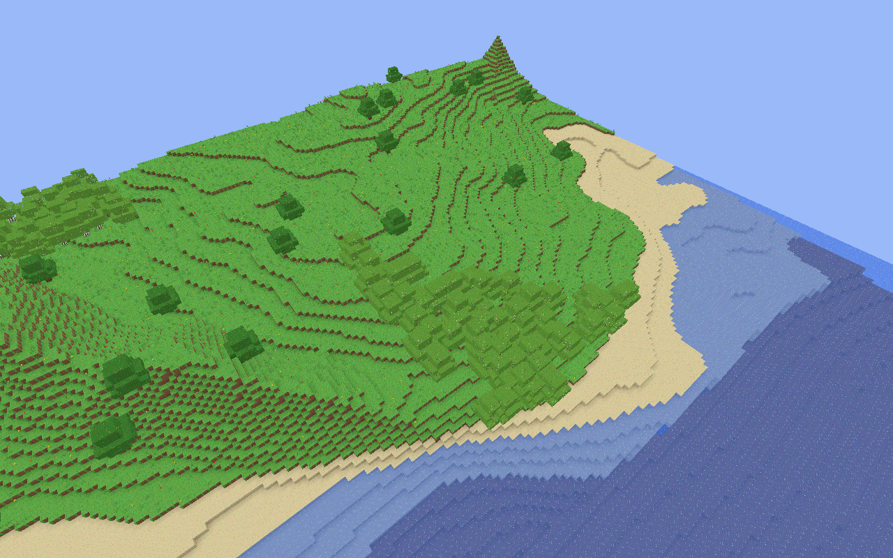
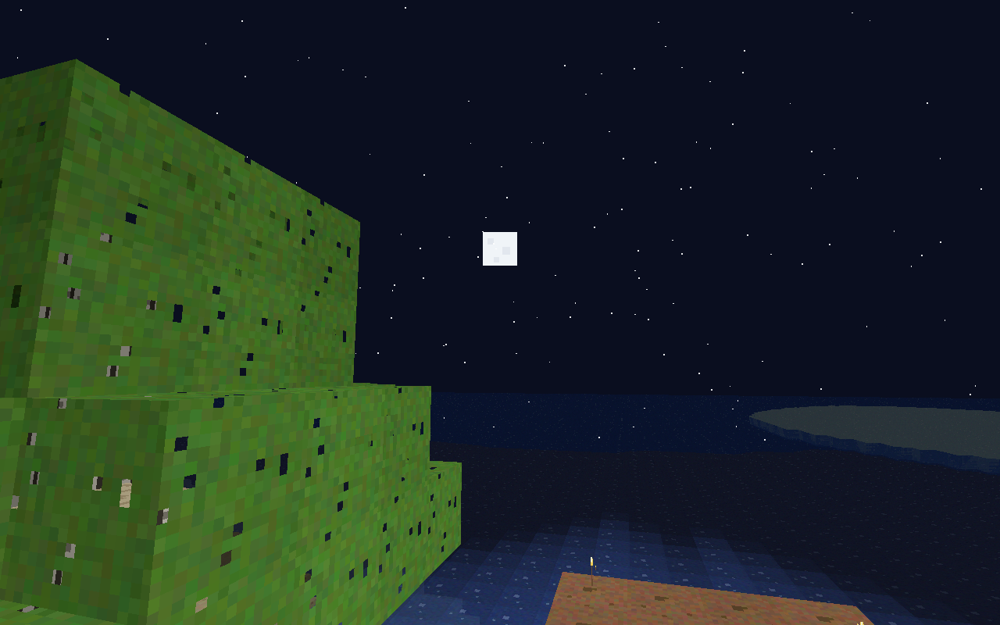
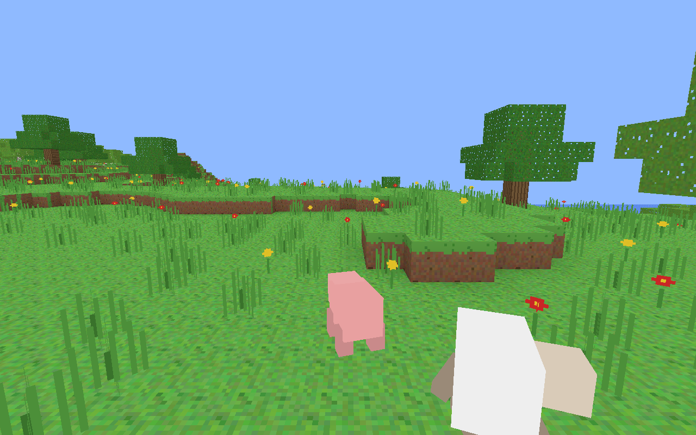
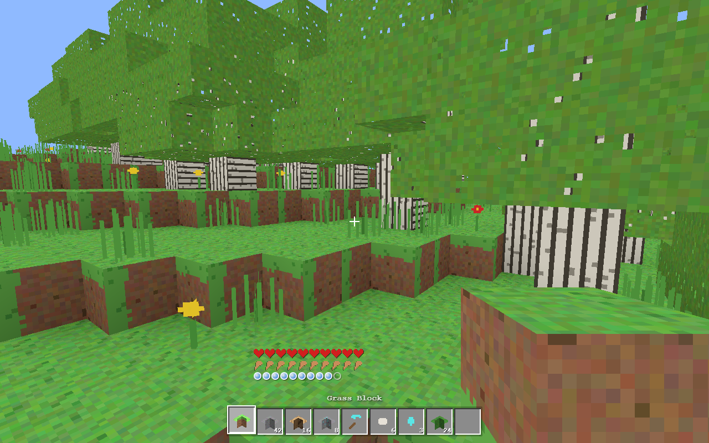
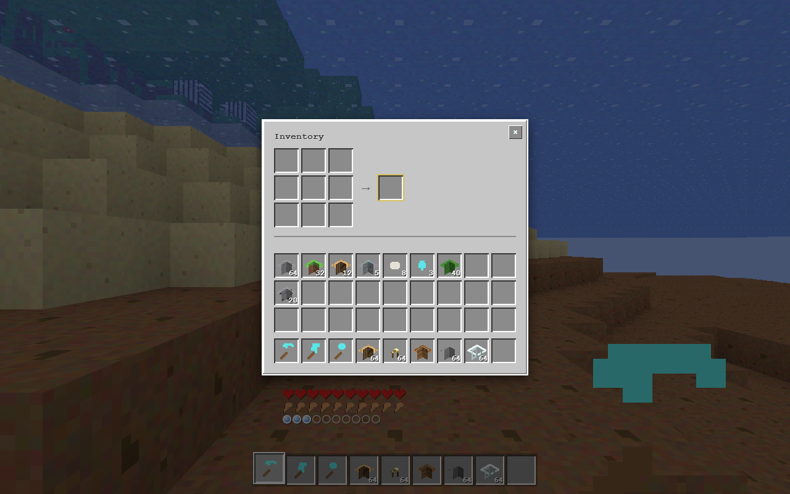

<div align="center">

# ⛏️ Voxelheim

### A complete Minecraft-style voxel sandbox that runs in your browser — built from scratch in vanilla JavaScript.

No game engine. No build step. No dependencies to install to play. Just ES modules, a Web Worker, and [Three.js](https://threejs.org/).

<!-- Badges are self-contained shields.io images -->




</div>

---

## What is this?

**Voxelheim** is a from-scratch, browser-native voxel game inspired by Minecraft. Every system —
infinite procedural terrain, lighting, meshing, survival, crafting, mobs, textures, and sound — is
written by hand in plain JavaScript. There is **no engine**, **no framework**, and **no bundler**:
open the folder over a static server and play.

The terrain is generated and meshed off the main thread in a **Web Worker** and streamed in as you
move. Block and sky lighting are flood-filled and **baked per chunk mesh**, then blended with a live
day/night uniform in a patched material shader. Textures and sound effects are **generated
procedurally at runtime** — the repo ships zero image or audio assets.

## Gallery

|  |  |
|---|---|
|  |  |
| **A living sky.** A 20-minute day/night cycle with a pixel sun & moon, 800 stars, and drifting clouds. Torches cast warm block-light. | **Mobs with AI.** Pigs and sheep wander and flee; zombies hunt at night. Each drops loot when defeated. |
|  |  |
| **Survival, first-person.** Hearts, hunger, and a hotbar with a held-item view model and view-bob. | **Craft & smelt.** A 36-slot inventory, 55 shaped/shapeless recipes, and furnace smelting. |

## Features

<table>
<tr>
<td valign="top" width="50%">

**🌍 World**
- Infinite procedural terrain, streamed in chunks
- 10 biomes: Ocean, Beach, Desert, Plains, Forest, Birch Forest, Taiga, Snowy Tundra, Mountains, Savanna
- Caves, depth-gated ore veins, oak / birch / spruce trees
- Sea, sand, gravel, snow, flowers & tall grass
- 20-minute day/night cycle: sun, moon, 800 stars, clouds

**❤️ Survival**
- Health, hunger, and food restoration
- Natural regeneration when well-fed
- Fall, drowning, and lava damage
- Death screen and respawn
- Creative / survival toggle, plus fly

</td>
<td valign="top" width="50%">

**🔨 Crafting & Mining**
- Mining with correct-tool logic and tool tiers
- Break particles and block-break progression
- Item drops with magnet-style pickup
- 36-slot inventory, drag & split stacks
- 55 shaped + shapeless recipes
- Crafting table (3×3) and furnace smelting

**🐷 Mobs**
- Pigs, sheep, and zombies
- Wander / flee / hunt AI
- Day & night spawning rules
- Melee combat and loot drops

**💾 Persistence**
- World saved to IndexedDB (autosave + manual)
- Pause menu: Resume / Save

</td>
</tr>
</table>

**🎨 Rendering & Engine**
- Worker-based chunk generation + meshing with ambient occlusion
- Skylight + block-light flood-fill, baked per mesh, blended with a live daylight uniform
- Procedurally generated block textures (no image assets)
- Procedurally synthesized sound effects (no audio assets)
- Held-item view model and view bobbing
- Pure, Node-testable game modules with zero DOM/Three dependency

## Play / Run locally

ES modules and Web Workers require a real HTTP origin — opening `index.html` from `file://` will not
work. Serve the folder with any static server:

```bash
cd mc
python -m http.server 8177
# then open http://localhost:8177
```

Click the screen to lock the mouse and start playing.

### Controls

| Input | Action |
|-------|--------|
| **W A S D** | Move |
| **Space** | Jump / swim up |
| **Shift** | Sneak (won't walk off ledges) |
| **Ctrl** / **R** | Sprint |
| **Mouse** | Look |
| **Left click** | Break block / attack mob (hold to mine) |
| **Right click** | Place block / use table & furnace / eat (hold) |
| **1–9** / **mouse wheel** | Select hotbar slot |
| **E** | Inventory + crafting (3×3 near a table) |
| **F** | Toggle fly (creative) |
| **G** | Toggle creative / survival |
| **F3** | Debug overlay |
| **Esc** | Pause menu (Resume / Save) |

## Architecture

The game logic lives in **pure, side-effect-free modules** — `noise`, `worldgen`, `lighting`,
`mesher`, `blocks`, `items`, `recipes`, `inventory` — with no dependency on the DOM or Three.js.
That makes them runnable and unit-testable in plain Node.

- The **Web Worker** imports the world-gen and mesher directly and returns geometry buffers, so
  terrain generation never blocks the render loop.
- The **main thread** owns the authoritative block data for physics and raycasting.
- **Lighting** is baked into each chunk mesh and combined with a day/night `daylight` uniform inside
  a patched `MeshBasicMaterial` shader.
- **Textures** and **audio** are generated at runtime on canvases and the Web Audio API — the repo
  ships no binary assets.

### Tests

The pure modules ship with Node test suites:

```bash
cd mc
for t in noise worldgen mesh recipes inventory; do node test/test-$t.mjs; done
```

<div align="center">
<sub>Built from scratch with vanilla JavaScript and Three.js — no engine, no build step.</sub>
</div>
